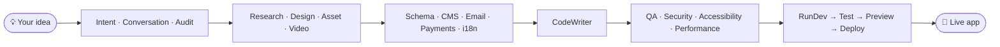

<div align="center">

# 🤖 AI Builder — Agent Setup

**The "brain" behind an AI website-and-app builder.**

Run one command and it provisions **27 specialized AI agents** on your Anthropic
account — each an expert at one job (research, design, code, security, deploy…) —
coordinated by a single orchestrator agent.

<sub>Built with</sub>
[](https://nestjs.com/)
[](https://bun.sh/)
[](https://console.anthropic.com/)

</div>

> [!NOTE]
> You do **not** need to be a programmer to run this. Just follow the
> [Step-by-step guide](#-step-by-step-guide) in order.

---

## 📑 Contents

**Getting started**
- [What it does](#-what-it-does)
- [Quick start](#-quick-start)
- [Step-by-step guide](#-step-by-step-guide)
- [Environment variables](#-environment-variables)
- [Re-running & cleanup](#-re-running--cleanup)
- [FAQ](#-faq)
- [Troubleshooting](#-troubleshooting)

**How it works (technical deep-dive)**
- [The big picture](#-the-big-picture)
- [How a website gets built — the 10 phases](#-how-a-website-gets-built--the-10-phases)
- [Parallelism: what runs at the same time](#-parallelism-what-runs-at-the-same-time)
- [The 27 agents (full reference)](#-the-27-agents-full-reference)
- [Brains: the 3 AI models](#-brains-the-3-ai-models)
- [Hands: the tools each agent can use](#-hands-the-tools-each-agent-can-use)
- [MCP servers (external superpowers)](#-mcp-servers-external-superpowers)
- [Component libraries & skills](#-component-libraries--skills)
- [Memory & persona](#-memory--persona)
- [Vault & environment](#-vault--environment)
- [Security gate & auto-fix loop](#-security-gate--auto-fix-loop)
- [How your images & links are respected](#-how-your-images--links-are-respected)
- [Token budget](#-token-budget)

**Run builds (runtime API)**
- [Running builds: the runtime API](#-running-builds-the-runtime-api)
- [Watching it work in realtime](#-watching-it-work-in-realtime)

**Reference**
- [For developers](#-for-developers)

---

## ✨ What it does

Running the setup command **once** will:

| Step | What happens |
| :--: | :-- |
| 1️⃣ | **Loads your vault** — a secure box on Anthropic's servers that holds your API keys |
| 2️⃣ | **Uses your environment** — the workspace the agents run inside |
| 3️⃣ | **Creates 27 agents** — the AI workers (see [the full list](#-the-27-agents)) |
| 4️⃣ | **Saves the results** — writes every agent ID to a file other apps can read |

It's a **one-time provisioning step**, not something that runs all day.



---

## ⚡ Quick start

> Already have Bun and your Anthropic API key? Do this:

```bash
bun install
cp .env.example .env        # then fill in ANTHROPIC_API_KEY (vault + env auto-create)
bun run setup:pipeline
```

New here? Follow the full guide below. 👇

---

## 🧭 Step-by-step guide

### 1. Install Bun (one time)

Bun is the tool that runs this project.

**macOS / Linux**
```bash
curl -fsSL https://bun.sh/install | bash
```

**Windows (PowerShell)**
```powershell
powershell -c "irm bun.sh/install.ps1 | iex"
```

Close and reopen your terminal, then confirm it works:
```bash
bun --version   # a version number like 1.3.14 means you're good
```

### 2. Get your Anthropic API key

You only need **one** value to start — your API key, from the
**[Anthropic Console](https://console.anthropic.com)**.

| Value | Where to get it |
| :-- | :-- |
| `ANTHROPIC_API_KEY` | **API Keys** → *Create Key* (starts with `sk-ant-…`) |

> [!TIP]
> The **vault** and **environment** are created for you automatically on the first run and
> written back into your `.env` — you don't need to create them in the console. (If you already
> have IDs, paste them in and they'll be reused instead.)

> [!WARNING]
> Treat your API key like a password. Never share it or commit it publicly.

### 3. Set up the project

```bash
cd path/to/agents     # the folder where this project lives
bun install           # install dependencies
cp .env.example .env  # create your settings file
```

### 4. Add your key to `.env`

Open `.env` in any text editor and fill in the **one required** value:

```ini
ANTHROPIC_API_KEY=sk-ant-your-key-here
```

Leave `ANTHROPIC_VAULT_ID` and `ANTHROPIC_ENVIRONMENT_ID` **blank** — the setup creates them on
the first run and fills them in for you. Everything else is **optional** — see
[Environment variables](#-environment-variables). Save the file.

### 5. Run it 🚀

```bash
bun run setup:pipeline
```

You'll see live progress:

```text
📦 Step 1/4: Vault
   Vault created → vlt_01...
🌍 Step 2/4: Environment
   Environment created → env_01...
   📝 Saved ANTHROPIC_VAULT_ID + ANTHROPIC_ENVIRONMENT_ID to /your/project/.env
🤖 Step 3/4: Agents
   ✅ Intent Agent  → agent_01EU...
   ✅ Design Agent  → agent_01Wv...
   ...
💾 Step 4/4: Saving agents.config.json
   ✅ Pipeline setup complete!
```

On the **first** run the vault and environment are created and their IDs written into your `.env`;
every later run sees those IDs and **reuses** them (no duplicates).

When it finishes, all 27 agent IDs are saved to:

```text
src/pipeline/output/agents.config.json
```

🎉 **You're done.**

---

## 🔑 Environment variables

There is only **1 required** value — your API key. Everything else is optional: leave an
optional key blank and the project simply skips that feature with a friendly `Skipping…` note
instead of failing.

### Required

| Key | What it's for | Where to get it |
| :-- | :-- | :-- |
| `ANTHROPIC_API_KEY` | Talking to Anthropic's AI | [Console → API Keys](https://console.anthropic.com/settings/keys) |

### Auto-created (leave blank)

These are **created for you** on the first `bun run setup:pipeline` and written back into `.env`,
then reused on every later run. Only fill them in manually if you already have IDs you want to reuse.

| Key | What it's for | Source |
| :-- | :-- | :-- |
| `ANTHROPIC_VAULT_ID` | The secure vault for your keys | Auto-created (or paste an existing `vlt_…`) |
| `ANTHROPIC_ENVIRONMENT_ID` | The workspace agents run in | Auto-created (or paste an existing `env_…`) |
| `ANTHROPIC_MEMORY_STORE_ID` | Persona + cross-session memory | Auto-created (or paste an existing `memstore_…`) |

### Optional (turn features on)

<details>
<summary><strong>Show all optional keys</strong></summary>

| Key | Feature | Where to get it |
| :-- | :-- | :-- |
| `INSFORGE_API_KEY` | Database | Your [InsForge](https://insforge.dev) dashboard → API Keys |
| `COOLIFY_API_TOKEN` | Deploy / preview sites | Your [Coolify](https://coolify.io) instance → Keys & Tokens |
| `UNSPLASH_ACCESS_KEY` | Stock photos (if blank, Asset falls back to Pexels, then keyless online sources/web search, then on-brand generated SVG art — never grey placeholders) | [Unsplash Developers](https://unsplash.com/developers) |
| `PEXELS_API_KEY` | *Optional* — free stock **photos + videos**. Used by the Asset agent when no Unsplash key is set, and by the Video agent for real stock footage when no Higgsfield key is set | [Pexels API](https://www.pexels.com/api/) |
| `R2_*` keys | File / image storage | [Cloudflare → R2 → API Tokens](https://dash.cloudflare.com/?to=/:account/r2/api-tokens) |
| `RESEND_API_KEY` | Sending emails | [Resend → API Keys](https://resend.com/api-keys) |
| `EMAIL_DOMAIN` | Your verified send domain — emails go out as `{name}@EMAIL_DOMAIN` | [Resend → Domains](https://resend.com/domains) |
| `AI_NAME` | *Optional* — your builder's brand name, shown in the API docs title as `{AI_NAME} — AI Builder` (defaults to `AI Builder` when blank) | — |
| `PORT` | *Optional* — port the runtime API listens on (defaults to `3000`) | — |
| `CORS_ORIGIN` | *Optional* — comma-separated allowed origin(s) for your frontend (defaults to `*` for local dev) | — |
| `STRIPE_SECRET_KEY` | Payments (Stripe) | [Stripe → API keys](https://dashboard.stripe.com/apikeys) |
| `LEMONSQUEEZY_API_KEY` | Payments (Lemon Squeezy) | [Lemon Squeezy → API](https://app.lemonsqueezy.com/settings/api) |
| `PADDLE_API_KEY` | Payments (Paddle) | [Paddle → Authentication](https://vendors.paddle.com/authentication-v2) |
| `PAYSTACK_SECRET_KEY` | Payments (Paystack) | [Paystack → API Keys](https://dashboard.paystack.com/#/settings/developers) |
| `PAYPAL_CLIENT_SECRET` | Payments (PayPal) | [PayPal → Apps & Credentials](https://developer.paypal.com/dashboard/applications) |
| `HIGGSFIELD_API_KEY` | AI-generated video. Without it the Video agent falls back to Pexels stock footage (if `PEXELS_API_KEY` is set), and is skipped only if **both** are missing | [Higgsfield](https://higgsfield.ai) → API access |
| `REFERO_API_KEY` | Design research — grounds the Design & Research agents in real product screens via [Refero MCP](https://api.refero.design/mcp) (needs Refero Pro) | [Refero → MCP](https://refero.design/mcp) |
| `DAYTONA_*` keys | Sandboxed dev environments | [Daytona → Keys](https://app.daytona.io/dashboard/keys) |

</details>

---

## 🔁 Re-running & cleanup

**Safe to run again any time.** The setup is **idempotent** — re-running finds each agent
by name and **updates it in place** instead of creating a duplicate. Tweak an agent, then:

```bash
bun run setup:pipeline
```

Got leftover duplicates from an early/failed run? Clean them up with:

```bash
bun run archive:duplicates
```

This keeps one agent per name (preferring the IDs in `agents.config.json`) and archives the
rest. Agents with a unique name are never touched.

### Start completely fresh (purge everything)

Want a blank slate? This wipes the whole Managed Agents workspace — **sessions** and
**vaults** are permanently deleted, **agents** are archived, and the local
`agents.config.json` is cleared:

```bash
bun run purge:all                            # DRY RUN — just shows what would be removed
bun run purge:all --yes                      # actually purge agents + vaults + sessions
bun run purge:all --yes --with-environments  # also delete the environment(s)
bun run purge:all --yes --with-memory        # also delete the memory store(s) — wipes saved persona
```

It also **blanks the auto-generated IDs in your `.env`** for whatever it deleted, so the next
setup re-provisions them cleanly (never reusing a dead ID):

- `ANTHROPIC_VAULT_ID` → always cleared (vaults are always purged)
- `ANTHROPIC_ENVIRONMENT_ID` → cleared only with `--with-environments`
- `ANTHROPIC_MEMORY_STORE_ID` → cleared only with `--with-memory`

> ⚠️ **Destructive and irreversible.** It's a dry run by default; nothing is deleted (and your
> `.env` is untouched) until you add `--yes`. After purging, run `bun run setup:pipeline` to
> provision everything fresh.

---

## ❓ FAQ

<details>
<summary><strong>Do I need to keep this running?</strong></summary>

No. It's a one-time setup. Run it, it creates the agents, it stops.
</details>

<details>
<summary><strong>It said "Skipping … not in env" — did something break?</strong></summary>

No, that's normal. It just means an optional key was blank, so that feature was skipped on
purpose.
</details>

<details>
<summary><strong>Where do the agent IDs go?</strong></summary>

Into `src/pipeline/output/agents.config.json` after a successful run.
</details>

<details>
<summary><strong>Which address do emails come from?</strong></summary>

From whatever domain you set in `EMAIL_DOMAIN` (e.g. `noreply@your-domain.com`). It must be
a domain you've verified with Resend.
</details>

---

## 🛠 Troubleshooting

| Message | Meaning | Fix |
| :-- | :-- | :-- |
| `Configuration key ANTHROPIC_API_KEY does not exist` | Key is missing | Ensure `.env` exists and has `ANTHROPIC_API_KEY` filled in |
| `401` / `authentication` error | Key is wrong or expired | Create a fresh key in the Console and paste it again |
| `command not found: bun` | Bun isn't installed | Reinstall Bun (step 1) and reopen your terminal |
| `Skipping … not in env` | An optional key is blank | Safe to ignore — unless you wanted that feature |

> Still stuck? Copy the full error message and share it with whoever set this project up.

---

## 🗺 The big picture

Think of this as a **digital software company staffed entirely by AI**.

- There are **27 agents**. 26 of them are *workers*, each an expert at exactly one job.
- The 27th is the **Orchestrator** — the *project manager*. It doesn't write code itself;
  it decides **who works when**, **who can work at the same time**, and **what to skip**.
- Every worker speaks the same language: it reads some **JSON** (structured notes) from the
  workers before it, does its one job, and hands **JSON** to the workers after it.

Technically, the Orchestrator is created as a **multi-agent “coordinator”** that holds the IDs
of all 26 workers. When you ask for a website, the coordinator runs them in a fixed recipe of
**10 phases** (below). Some phases are a single worker; others fire several workers **at the
same time** to save time.

> One-liner: *Idea in → 27 specialists collaborate in phases → live website out.*

---

## 🏭 How a website gets built — the 10 phases

This is the recipe the Orchestrator follows for every build. “Sequential” means one-at-a-time;
“parallel” means several agents work simultaneously.

| Phase | Name | What happens | Mode |
| :--: | :-- | :-- | :-- |
| 1 | **Intake** | `intent` understands your request → `conversation` asks **one** question *only if* it's unclear → `audit` security-scans the prompt | Sequential |
| 2 | **Research & design** | `research`, `design`, `asset`, `video` all start together | **Parallel** |
| 3 | **Animation** | `animation` builds motion files (needs the design first) | Sequential |
| 4 | **Backend** | `schema`, `cms`, `email`, `payments`, `i18n` start together (each skipped if not needed) | **Parallel** |
| 5 | **Generation** | `codewriter` writes the entire Next.js app, using everything above | Sequential |
| 6 | **Quality gates** | `qas`, `security`, `accessibility`, `performance` all check the code together | **Parallel** |
| 7 | **Build** | `audit` runs again on the real code → `rundev` installs deps + builds it | Sequential |
| 8 | **Testing** | `testing` runs end-to-end + unit tests | Sequential |
| 9 | **Preview** | `preview` deploys a temporary site, then **pauses for your approval** | Sequential |
| 10 | **Publish** | *(only when you click publish)* `deploy` goes live → `version` saves a snapshot | Sequential |

**Two background agents** (`custommcp`, `knowledgebase`) run **outside** this flow whenever you
register a tool or upload a document — they never block the build.

**Self-healing loops** are built in:
- If **build fails** → `autofix` (build mode) patches the code → back to `rundev`. Up to **3 tries**.
- If **security/quality finds something critical** → `autofix` (fix mode) patches it → re-scan.
  Up to **3 tries**. If a critical issue still can't be fixed, **publishing is blocked** and you're told why.

---

## ⚡ Parallelism: what runs at the same time

Running independent agents together is what makes the pipeline fast. Here are the **3 parallel
groups** (everything else is one-at-a-time):

```text
GROUP A — after the prompt is understood (Phase 2):
   research  ┐
   design    ├─ all run together
   asset     │
   video     ┘

GROUP B — after the design is ready (Phase 4):
   schema    ┐
   cms       ├─ all run together (each skipped if your site doesn't need it)
   email     │
   payments  │
   i18n      ┘

GROUP C — after the code is written (Phase 6):
   qas           ┐
   security      ├─ all run together
   accessibility │
   performance   ┘
```

Each agent carries a `parallel: true/false` flag in its metadata, and the Orchestrator uses it to
decide grouping. The “conductor” waits for **all** agents in a group to finish before moving on.

---

## 🧩 The 27 agents (full reference)

Every agent, what it does in plain English, the AI model it uses, the tools it's allowed to use,
whether it runs in a parallel group, and the condition that decides if it runs at all.

| # | Agent | Plain-English job | Model | Tools | Parallel? | Runs only if… |
| :--: | :-- | :-- | :-- | :-- | :--: | :-- |
| 1 | **Intent** | Understands your prompt + attachments, writes the master spec | 🔴 Opus | read + web | — | always (entry point) |
| 2 | **Conversation** | Asks **one** clarifying question | 🟢 Haiku | none (pure thinking) | — | the request is unclear (`confidence < 0.7`) |
| 3 | **Audit** | Security-scans the prompt, then later the generated code | 🟢 Haiku | shell + read | — | always (runs **twice**) |
| 4 | **Research** | Studies the industry, competitors, content ideas | 🟡 Sonnet | read + web (+Refero) | ✅ A | always |
| 5 | **Design** | Picks colors, fonts, spacing, component library → `DesignSpec` | 🟡 Sonnet | read + web (+Refero) | ✅ A | always |
| 6 | **Asset** | Hosts your images + finds stock photos (Unsplash → Pexels → keyless online → generated SVG), uploads to storage | 🟡 Sonnet | code + web | ✅ A | always |
| 7 | **Video** | Background videos — AI-generated (Higgsfield) or real stock footage (Pexels) | 🟡 Sonnet | code + Higgsfield | ✅ A | `HIGGSFIELD_API_KEY` **or** `PEXELS_API_KEY` is set |
| 8 | **Animation** | Builds the motion layer (GSAP / Motion / Three.js) | 🟡 Sonnet | code + web | — | always (waits for Design) |
| 9 | **Schema** | Designs the database + security rules | 🟡 Sonnet | code + InsForge | ✅ B | site needs a database or login |
| 10 | **CMS** | Sets up editable content collections | 🟡 Sonnet | code + InsForge | ✅ B | site needs a CMS |
| 11 | **Email** | Builds transactional emails + contact-form handling | 🟡 Sonnet | code | ✅ B | needs email **or** has a contact form |
| 12 | **Payments** | Wires Stripe / Paystack / Paddle / etc. | 🟡 Sonnet | code | ✅ B | site takes payments |
| 13 | **i18n** | Adds multi-language translation files | 🟢 Haiku | code | ✅ B | site needs translations |
| 14 | **CodeWriter** | Writes the **entire** Next.js app — the main event | 🔴 Opus | code + web | — | always (waits for everyone above) |
| 15 | **QAS** | Quality + light security scan of the code | 🟢 Haiku | shell + read | ✅ C | always |
| 16 | **Security** | Deep scan: dependency CVEs + code vulnerabilities (SAST) | 🟡 Sonnet | shell + read | ✅ C | always |
| 17 | **Accessibility** | Checks WCAG 2.1 AA (screen-reader friendliness) | 🟢 Haiku | shell + read | ✅ C | always |
| 18 | **Performance** | Checks Core Web Vitals + Lighthouse speed | 🟢 Haiku | shell + read | ✅ C | always |
| 19 | **RunDev** | Installs dependencies + builds the app in a sandbox | 🟡 Sonnet | code | — | always |
| 20 | **AutoFix** | Fixes build errors **and** security findings | 🟡 Sonnet | code | — | a build fails or a critical issue is found |
| 21 | **Testing** | Runs end-to-end (Playwright) + unit (Vitest) tests | 🟡 Sonnet | code | — | always (after a clean build) |
| 22 | **Preview** | Deploys a temporary site for you to review | 🟡 Sonnet | shell + Coolify | — | always |
| 23 | **Deploy** | Publishes the production site | 🟡 Sonnet | shell + Coolify | — | **you** click publish |
| 24 | **Version** | Saves a git snapshot + version record | 🟢 Haiku | shell | — | after a publish |
| 25 | **CustomMCP** | Lets you register your own tools/skills | 🟡 Sonnet | code | bg | you register an MCP |
| 26 | **KnowledgeBase** | Ingests your documents for retrieval (RAG) | 🟡 Sonnet | code + InsForge | bg | you upload a document |
| 0 | **Orchestrator** | The conductor — coordinates all 26 above | 🔴 Opus | coordinator | — | always |

*A / B / C* = the parallel group from the section above. *bg* = background (never blocks the build).

---

## 🧠 Brains: the 3 AI models

Each agent is matched to the **cheapest model that can do its job well** — fast/cheap for simple
checks, powerful/expensive only where it really matters. This keeps builds fast and affordable.

| Badge | Model | Speed & cost | Used for | Agents |
| :--: | :-- | :-- | :-- | :-- |
| 🟢 | **Haiku** (`claude-haiku-4-5`) | Fastest, cheapest | Quick checks & simple writing | Conversation, Audit, i18n, QAS, Accessibility, Performance, Version |
| 🟡 | **Sonnet** (`claude-sonnet-4-6`) | Balanced | Most real work | Research, Design, Animation, Asset, Video, Schema, CMS, Email, Payments, RunDev, AutoFix, Testing, Preview, Deploy, Security, CustomMCP, KnowledgeBase |
| 🔴 | **Opus** (`claude-opus-4-8`) | Most powerful | The hardest thinking | Intent, CodeWriter, Orchestrator |

> Defined in `src/pipeline/config/models.config.ts`. Change one line to re-assign an agent's brain.

---

## 🖐 Hands: the tools each agent can use

An agent can only touch what its **toolset** allows — a safety feature so, say, the Performance
checker can read files but never *write* them. Toolsets live in `src/pipeline/config/tools.config.ts`.

| Toolset | What the agent can do | Plain English |
| :-- | :-- | :-- |
| `NONE` | nothing | Pure reasoning only (e.g. Conversation just thinks of a question) |
| `READ` | read · web_search · web_fetch | **Look & browse** — open files/images (vision) + read the live web |
| `BASH` | bash | **Run commands** in a terminal |
| `BASH_READ` | bash · read · glob · grep | **Inspect** — run commands + read/search files, but **not** edit them |
| `CODE` | bash · read · write · edit · glob · grep | **Full developer** — read, write, edit files + run commands |
| `CODE_WEB` | CODE + web_search · web_fetch | **Developer + live docs** — everything in CODE plus reading current documentation |
| `withMcp(x)` | adds an MCP server | **Plug in a superpower** (database, hosting, design search) — see below |

This is why, for example, the **CodeWriter** uses `CODE_WEB` (it must write code *and* read the
latest shadcn/HeroUI docs), while **Security** uses `BASH_READ` (it must inspect and run scanners
but should never modify your code — that's AutoFix's job).

---

## 🔌 MCP servers (external superpowers)

An **MCP** (Model Context Protocol) server is a **secure plug-in** that gives an agent an ability
it doesn't have on its own — like talking to a database or a hosting platform. Anthropic agents can
only connect to **remote URL** MCP servers, and they authenticate using a token kept in your
**vault** (never in the code). Configured in `src/pipeline/config/mcps.config.ts`.

| MCP | Gives agents the power to… | Used by | Needs |
| :-- | :-- | :-- | :-- |
| **InsForge** | Create databases, tables, auth, storage, vector search | Schema, CMS, KnowledgeBase | `INSFORGE_API_KEY` |
| **Coolify** | Deploy preview + production sites | Preview, Deploy | `COOLIFY_API_TOKEN` |
| **Refero** | Search real product/UI screenshots for design inspiration | Design, Research | `REFERO_API_KEY` (Refero Pro) — *optional* |
| **Higgsfield** | Generate AI background videos | Video | `HIGGSFIELD_API_KEY` — *optional* |

If an MCP's key is missing, that power is simply not attached and the agent works without it
(Refero and Higgsfield are fully optional; InsForge/Coolify power the data + deploy features).
The **Higgsfield** MCP is attached to the Video agent only when `HIGGSFIELD_API_KEY` is set — it
prefers the MCP tools and falls back to Higgsfield's REST API if a tool call fails.

**Video source selection (Higgsfield vs Pexels).** The Video agent chooses its source by business
type: real-world/physical-venue sites (restaurant, real-estate, hospitality, travel, fitness,
wellness, events, automotive, construction, agriculture) **prefer authentic Pexels stock footage**
(when `PEXELS_API_KEY` is set) even if Higgsfield is available; abstract/digital sites (saas, tech,
gaming, crypto, fintech) keep **Higgsfield AI** generation. With only one key set it uses that one,
and the agent is skipped only when **both** `HIGGSFIELD_API_KEY` and `PEXELS_API_KEY` are missing.

> **Why not a shadcn/HeroUI MCP?** Those are **local** plug-ins meant for code editors (they run on
> your own machine via `npx shadcn@latest mcp`). The deployed cloud agents can only use **remote**
> MCPs, so component-library knowledge is delivered a different way — see the next section.

---

## 🎨 Component libraries & skills

Instead of guessing how to use a UI library, the relevant agents get **live web access** and use the
**shadcn command-line tool** to install real, current components. The Design Agent picks the library
**per project**; the CodeWriter builds with it.

**Main libraries** (one is chosen per build):
- **[shadcn/ui](https://ui.shadcn.com)** *(default)* — marketing sites, landing pages, highly custom/animated designs.
- **[HeroUI](https://heroui.com)** — app-like UIs: dashboards, admin panels, SaaS shells, data-dense tools.

**Animated component registries** (used on **every** build, alongside the main library):
- **[Animate UI](https://animate-ui.com)** *(primary)* and **[React Bits](https://reactbits.dev)** —
  ready-made motion components. The Animation + CodeWriter agents install them with the shadcn CLI
  (`npx shadcn@latest add @animate-ui/<component>` / `@react-bits/<component>`) instead of hand-writing
  animation. These are **registries**, not MCPs.

**Supplementary decoration:**
- **[Uiverse](https://uiverse.io)** — ~4,400 MIT-licensed CSS/Tailwind elements (fancy loaders, glass
  cards, novelty buttons). It's **copy-paste only** (no CLI, no registry, no MCP), so the CodeWriter
  fetches an element, converts it to a TSX component, and **re-tokenizes** it to the project's palette +
  spacing. Used for flourishes only — never for form controls (those stay shadcn/HeroUI).

> **How the agents "know" the libraries:** distilled rules in their prompts + `web_search`/`web_fetch`
> for the *current* official docs + the shadcn CLI to install real code. They do **not** use the
> editor's local shadcn/HeroUI MCPs or Cursor skills (those can't run inside cloud agents).

---

## 🧠 Memory & persona

"Memory" here is four different things working together — and most of it is handled by the
**Anthropic platform**, not by hand-rolled code:

1. **Session memory (this build).** Each build runs in an Anthropic **session** that remembers the
   conversation — that's how the *Intent → one question → re-understand* loop works.
2. **Memory Store (across builds) — a real managed feature.** The setup provisions a **memory store**
   (`builder-memory`, ID saved to `.env` as `ANTHROPIC_MEMORY_STORE_ID`). When the runtime app
   attaches it to a session, Anthropic **mounts it as a folder in the sandbox and automatically adds a
   note to every agent's system prompt** telling it where to look — so persona/preferences are
   surfaced *without* any manual prompt injection. Agents read/write it with their normal file tools.
   It's seeded with a default `persona.md` + `user-instructions.md`; the runtime app overwrites those
   per user (brand colours, tone, do/don't rules — the way you set "persona").
3. **KnowledgeBase / RAG (your documents).** Upload PDFs/URLs/markdown → the **KnowledgeBase** agent
   chunks them, creates embeddings, and stores vectors in **InsForge pgvector**. At build time it
   finds the most relevant pieces and feeds them into the Intent + CodeWriter prompts — so the site is
   grounded in *your* real content.
4. **Working memory (within a build).** Every agent's full JSON output is passed forward to the agents
   that depend on it, never truncated. This is the pipeline's short-term scratchpad.

**Persona** isn't a separate agent — it comes from (a) each agent's fixed role/voice in its prompt,
(b) the **memory store** (custom instructions Anthropic auto-surfaces to every agent), and (c) the
brand signals + assets in your request shaping the generated site's look and tone.

> **Why no custom "MemoryService" that injects prompts?** Because the platform already does it: an
> attached memory store auto-mounts and auto-notes itself in the system prompt. We provision the store
> (like the vault + environment) and persist its ID; the **runtime app** attaches it to each session
> via `resources[]` (with optional per-session `instructions`, ≤4,096 chars). That's the supported,
> tamper-resistant path — re-implementing it in prompt text would fight the managed feature.

---

## 🔐 Vault & environment

Three Anthropic concepts the setup provisions for you — **automatically**:

- **Vault** — a secure box on Anthropic's servers that holds your secret keys (InsForge, Coolify,
  Refero, payment providers…). Agents reference the vault to authenticate to MCPs; the secrets never
  appear in the code. Created by `src/pipeline/vault/vault.service.ts`, which then adds one credential
  per key you set.
- **Environment** — the sandboxed workspace the agents run inside. Created by
  `src/pipeline/environment/environment.service.ts`.
- **Memory store** — persistent persona + preferences that survive across builds. Created (and seeded
  with a default `persona.md` + `user-instructions.md`) by `src/pipeline/memory/memory-store.service.ts`.
  The runtime app attaches it to each session so Anthropic auto-surfaces it to every agent.

**You don't pre-create any of them.** On the first run, if `ANTHROPIC_VAULT_ID` /
`ANTHROPIC_ENVIRONMENT_ID` / `ANTHROPIC_MEMORY_STORE_ID` are blank, the setup creates them, then writes
the new IDs back into your `.env` (via `src/pipeline/lib/env-file.ts`) so every later run reuses the
same resources instead of making new ones. If you'd rather use IDs you already have, just paste them
into `.env` and they'll be reused as-is. (Memory provisioning is non-fatal — if it can't be created,
setup logs a warning and continues; agents still work.)

---

## 🛡 Security gate & auto-fix loop

Security is enforced as a **gate before publishing**, not an afterthought:

1. The **Audit** agent scans your prompt up front (Phase 1) **and** the generated code (Phase 7).
2. In the quality gate (Phase 6), the **Security** agent runs two scans:
   - **Dependency CVEs** — checks your packages against known-vulnerability databases.
   - **SAST** — reads the code for injection, XSS, SSRF, secret exposure, broken auth/access rules.
3. Any **critical** finding is routed to **AutoFix** (fix mode), which patches the *fixable* ones.
4. The scanner **re-runs** to verify. This repeats up to **3 times**.
5. If a critical issue still can't be fixed → **publishing is blocked** and you get a clear explanation.

The same **AutoFix** agent also runs in *build mode* to repair compile errors in the RunDev loop — so
it has two jobs: fix broken builds, and fix security/quality findings.

---

## 🖼 How your images & links are respected

When you attach images, a logo, a brand kit, or reference URLs, they're honored end-to-end:

- The **Intent** agent records them in `mediaSignal` (and `referenceUrls`).
- The **Orchestrator** explicitly forwards these to **Design** and **Asset**.
- **Design** has *vision* — it opens your images directly to pull the **real** colors and typography,
  and fetches your reference URLs to match their style. Your brand colors/logo **override** defaults.
- **Asset** downloads your supplied images/logos, hosts them in storage, and uses them in their proper
  slots (logo, hero, gallery) — stock photos only fill the **leftover** slots. Your assets are never
  overwritten.

---

## 💰 Token budget

Every build has a **200,000-token** budget that the Orchestrator divides across the phases, so a single
agent can't burn the whole allowance. The lion's share goes to the **CodeWriter** (100k) since it writes
the whole app. If an agent goes over its slice, the Orchestrator emits a warning and continues with
slightly reduced output — it only aborts if the **total** 200k is exceeded.

| Stage | Budget | | Stage | Budget |
| :-- | --: | --- | :-- | --: |
| Intent + conversation | 5,000 | | CodeWriter | **100,000** |
| Audit (×2) | 3,000 | | QAS + security + a11y + perf | 9,000 |
| Research | 8,000 | | RunDev + autofix (×3) | 20,000 |
| Design | 6,000 | | Testing | 10,000 |
| Animation | 8,000 | | Preview + deploy | 5,000 |
| Asset + video | 4,000 | | Version | 2,000 |
| Schema + CMS | 10,000 | | Orchestration overhead | 3,000 |
| Email + payments + i18n | 10,000 | | **Total** | **200,000** |

---

## 🚀 Running builds: the runtime API

Provisioning (`setup:pipeline`) is a **one-time** step that creates the agents. To actually
**run builds**, this project also ships a thin **runtime API** that turns the provisioned
Orchestrator into an HTTP + streaming service your own frontend (in a separate repo) can call.

Start it:

```bash
bun run start:dev    # development — auto-restarts on file changes (recommended)
bun run start        # one-shot run, no watching
```

On startup it prints the live URLs straight to the terminal:

```
[Bootstrap] 🚀 Runtime API ready at http://localhost:3000
[Bootstrap] 📘 Swagger UI       → http://localhost:3000/docs
[Bootstrap] 🔮 Scalar reference → http://localhost:3000/reference
[Bootstrap] 🧩 OpenAPI JSON     → http://localhost:3000/docs-json
```

> The docs **title** comes from `AI_NAME` (e.g. `AI_NAME=Jax` → "Jax — AI Builder"). `.env` is not
> watched, so after changing it, restart the server (or save a `.ts` file to trigger a reload).

It reads `src/pipeline/output/agents.config.json`, opens an Anthropic **session** on the
Orchestrator, mounts your vault / environment / memory store, and exposes four endpoints:

| Method & path | What it does | Returns |
| :-- | :-- | :-- |
| `POST /builds` | Start a build from a prompt (+ optional image/link attachments) | `{ buildId, sessionId }` |
| `GET /builds/:id` | Poll the build's status (`running` · `awaiting_input` · `completed` · `error`) | status JSON |
| `GET /builds/:id/stream` | **Live SSE stream** of orchestrator events (see next section) | `text/event-stream` |
| `POST /builds/:id/approve` | Continue past the preview gate to deploy | `{ buildId, status }` |

A build is simply: **create a session → send your prompt (with any images/links as content
blocks) → stream the events back → approve at the preview gate.** The pause at preview is what
the `awaiting_input` status and the `approve` endpoint are for.

### Interactive API docs (built in)

When the server is running, open:

- **Swagger UI** → [`/docs`](http://localhost:3000/docs) (raw OpenAPI JSON at `/docs-json`)
- **Scalar reference** → [`/reference`](http://localhost:3000/reference)

CORS is enabled so your separate frontend can call these directly; lock it down in production by
setting `CORS_ORIGIN` to your app's origin(s).

> This repo is **backend-only** and framework-agnostic. Your frontend (Next.js, Remix, plain
> React, mobile — anything) lives in its own repo and just consumes these four endpoints.

---

## 👀 Watching it work in realtime

Yes — the `GET /builds/:id/stream` SSE feed shows the build happening **live, step by step**.
Each frame is one Anthropic session event, forwarded verbatim, so your UI can render:

| Event | What you see |
| :-- | :-- |
| `agent.thread_message_sent` / `received` | The Orchestrator **delegating to a sub-agent** (`from_agent_name` → `to_agent_name`) — the multi-agent hand-off |
| `agent.tool_use` | **Code being written** — each file write shows the path + contents; each `bash` shows the command |
| `agent.tool_result` | **Build output, test runs, errors** — the raw terminal feedback (`is_error` flags failures) |
| `agent.message` | The agent's narration ("Building the hero section…") |
| `agent.mcp_tool_use` / `mcp_tool_result` | External actions (database, deploy, design search) |
| `agent.thinking` | A "thinking…" **progress pulse** |

Two honest caveats so you build the UI correctly:

1. **It streams as *steps*, not token-by-token typing.** You get a complete file-write, a
   complete command result, a complete message per event — not characters appearing one by one
   (this SDK surface has no text-delta events).
2. **`agent.thinking` is a progress signal, not the reasoning text.** The platform exposes that
   the agent *is* thinking, but not *what* it's thinking — so you can show a spinner, not a
   chain-of-thought transcript.

The runtime forwards every event as `{ kind: <event.type>, payload: <raw event> }`, plus two
synthetic kinds — `status` (build lifecycle) and `error`. Rendering each `kind` nicely (a code
pane, a terminal pane, agent badges, a thinking indicator) is your frontend's job; the data is
all there, live.

---

## 👩‍💻 For developers

This is a [NestJS](https://nestjs.com/) project.

```bash
bun install                # install dependencies
bun run build              # type-check / compile
bun run setup:pipeline     # provision (or update) the 27 agents  ← run this first
bun run start              # serve the runtime API (POST /builds, SSE stream, /docs, /reference)
bun run start:dev          # ↑ same, in watch mode
bun run archive:duplicates # archive duplicate agents from old runs
bun run purge:all          # wipe agents+vaults+sessions for a fresh start (dry run; --yes to apply)
bun run test               # run unit tests
bun run smoke              # boot the full DI graph (no network / no API key)
bun audit --audit-level=high  # scan dependencies for known CVEs
```

### Continuous integration

Every push and pull request to `main` runs [`.github/workflows/ci.yml`](.github/workflows/ci.yml),
which fans out into four independent jobs:

| Job | Command | What it guards |
| --- | --- | --- |
| 🔍 **Audit** | `bun audit --audit-level=high` | Fails on high/critical dependency CVEs |
| 🏗 **Build** | `bun run build` | Compiles + type-checks the whole project |
| 🧪 **Test** | `bun run test:ci` | Runs the Jest unit suite |
| 💨 **Smoke** | `bun run smoke` | Boots the 27-agent DI graph — no network, no secrets |

The smoke job catches broken wiring (missing providers, circular deps) without
ever calling the Anthropic API, so it stays fast and needs no credentials.

**Project layout**

```text
src/
├── main.ts                 # serves the runtime API + Swagger (/docs) + Scalar (/reference)
├── app.module.ts           # wires PipelineModule + RuntimeModule
├── pipeline/               # PROVISIONING (the one-time setup)
│   ├── pipeline.service.ts     # orchestrates the whole setup
│   ├── agents/                 # one file per agent (27 total)
│   ├── config/                 # models, tools, and MCP server config
│   ├── vault/ · environment/   # vault + environment provisioning
│   ├── memory/                 # memory-store provisioning (persona + cross-session memory)
│   ├── lib/                    # helpers (idempotent agents, .env write-back/clear)
│   ├── *.command.ts            # CLI entrypoints: setup / archive / purge
│   └── output/                 # generated agents.config.json
└── runtime/                # RUNTIME (running builds)
    ├── build.controller.ts     # POST /builds, GET /builds/:id, SSE stream, approve
    ├── runtime.service.ts      # session create → send → stream → approve
    └── dto/                    # request/response DTOs (Swagger-annotated)
doc/instruct.md             # original specification (read-only)
```
